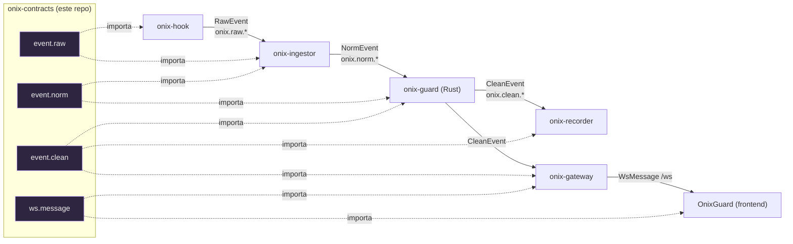

# onix-contracts

**Fuente única de verdad** de los contratos de OnixGuard: el shape de los eventos que viajan por NATS (`raw` → `norm` → `clean`), los mensajes del WebSocket, las herramientas MCP y la API REST del gateway. Todos los servicios (Go y Rust) importan tipos generados **desde aquí**, para que **Go y Rust no se desincronicen**.

> Regla de oro del polyrepo: si el contrato cambia, cambia **aquí**; el codegen regenera los tipos y los tests de contrato fallan si algún ejemplo deja de encajar.

---

## Qué contiene

```text
schemas/
  event.raw.schema.json     # RawEvent  — lo publica onix-hook      (onix.raw.*)
  event.norm.schema.json    # NormEvent — lo publica onix-ingestor  (onix.norm.*)
  event.clean.schema.json   # CleanEvent— lo publica onix-guard     (onix.clean.*)  ← sin credenciales
  ws.message.schema.json    # WsMessage — gateway → frontend por /ws
  mcp.methods.schema.json   # Entradas/salidas de reportar_al_jefe / pedir_al_jefe / consultar_plan
  rest.openapi.yaml         # Rutas REST de onix-gateway
examples/                   # Ejemplos reales que los tests validan contra los schemas
codegen/generate.sh         # JSON Schema → tipos Go + tipos Rust (quicktype). NO editar los *.gen.*
tests/validate.sh           # Tests de contrato (ajv): cada ejemplo debe validar contra su schema
go/                         # Paquete Go generado (module .../onix-contracts/go)
rust/                       # Crate Rust generado (onix-contracts)
```

## Cómo fluyen los eventos (por qué existen 3 schemas)



- **RawEvent**: lo que el hook ve en tu PC. Puede traer credenciales en `params`. No se persiste.
- **NormEvent**: raw validado y con `received_at`. Sigue crudo (aún no redactado).
- **CleanEvent**: **sin valores de credenciales** (solo `sha256` + `label`), con `params_hash`, `is_error`, `is_repetition`. Es lo único que se guarda y lo único que llega al frontend.

## Codegen (no se escriben tipos a mano)

```bash
bash codegen/generate.sh      # o `make codegen` desde onix-deploy
```

Genera:
- `go/onixcontracts/events.gen.go` — `RawEvent`, `NormEvent`, `CleanEvent`, `WsMessage` (+ enums).
- `rust/src/events.gen.rs` — los mismos tipos con `serde`.

Los archivos `*.gen.*` **se commitean** (para que cada servicio compile sin correr el codegen), pero **no se editan**: se regeneran desde `schemas/`.

## Tests de contrato

```bash
bash tests/validate.sh        # o `make test`
```

Valida cada archivo de `examples/` contra su schema (ajv, draft 2020-12). Es la prueba que corre en CI para cada repo que dependa del contrato: si un servicio rompe el shape, esto falla antes del deploy.

## Cómo lo consume cada servicio

- **Go** (`ingestor`, `recorder`, `orchestrator`, `gateway`, `hook`):
  ```go
  import "github.com/levapo97-cell/onix-contracts/go/onixcontracts"
  ```
- **Rust** (`guard`): en `Cargo.toml`
  ```toml
  onix-contracts = { git = "https://github.com/levapo97-cell/onix-contracts", package = "onix-contracts" }
  ```

## Enums canónicos (coinciden con el esquema de `onix-db`)

| Campo | Valores |
|-------|---------|
| `agent_role` | `project_lead`, `fullstack`, `designer`, `growth`, `sales`, `gm` |
| `hook` | `SessionStart`, `PreToolUse`, `PostToolUse`, `Stop`, `SubagentStop`, `Notification` |
| `credentials[].kind` | `api_key`, `token`, `password`, `conn_string`, `env` |
| `WsMessage.type` | `event`, `metrics`, `agent_status`, `report`, `alert`, `stage` |
| MCP `action` | `aprobar`, `cambios`, `responder` |

---

*Parte de OnixGuard · Fase 0 (Cimientos). Ver el plan en `OnixGuard/docs/PLAN.md` §4.*
